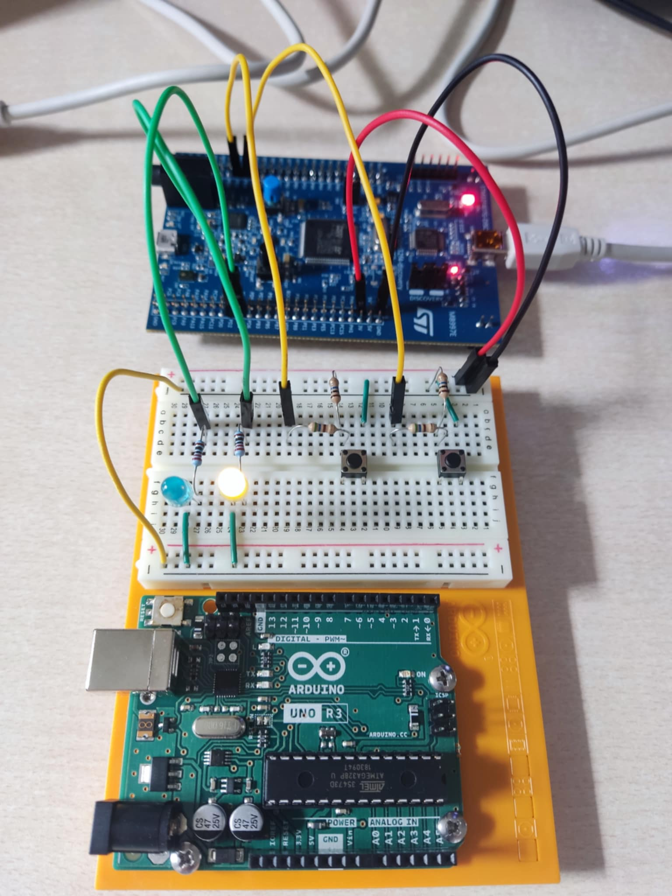
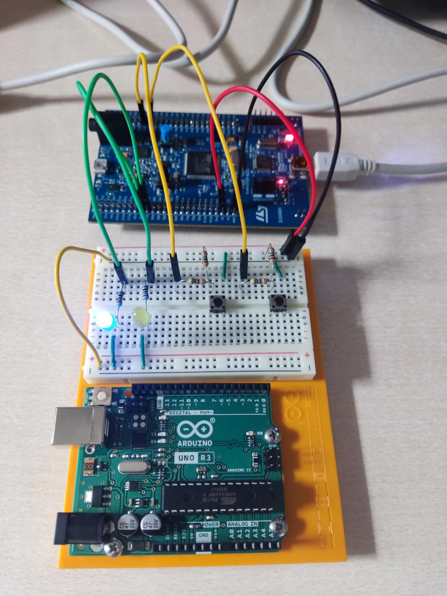
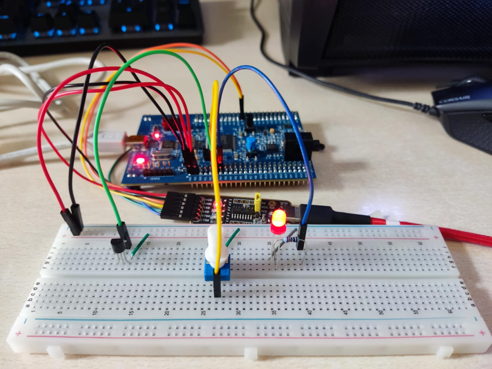
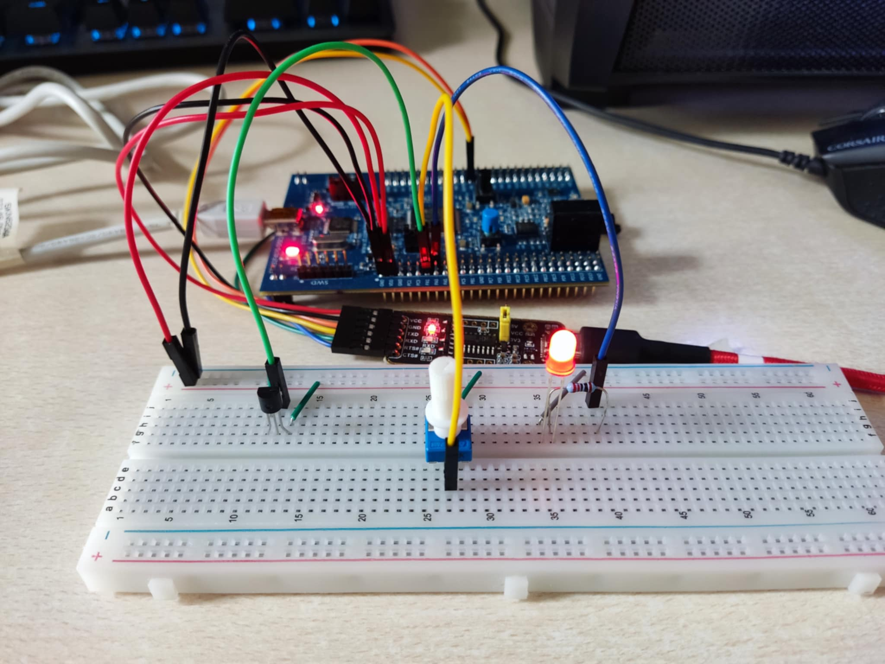
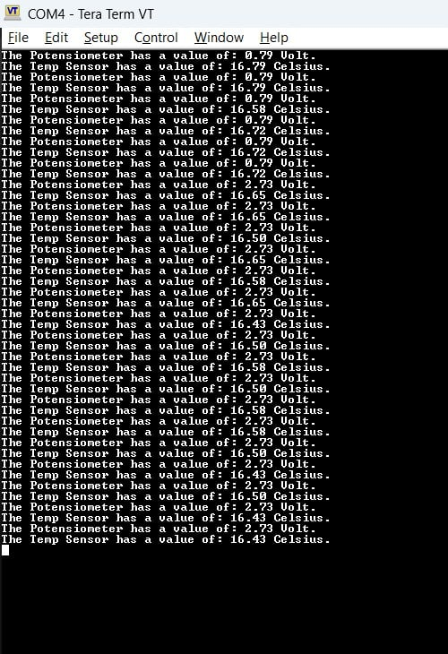
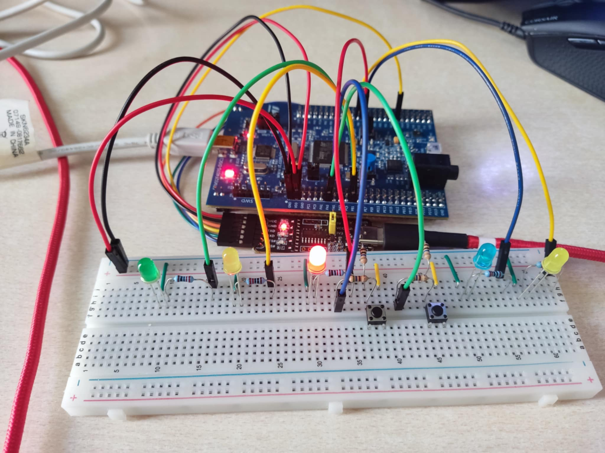
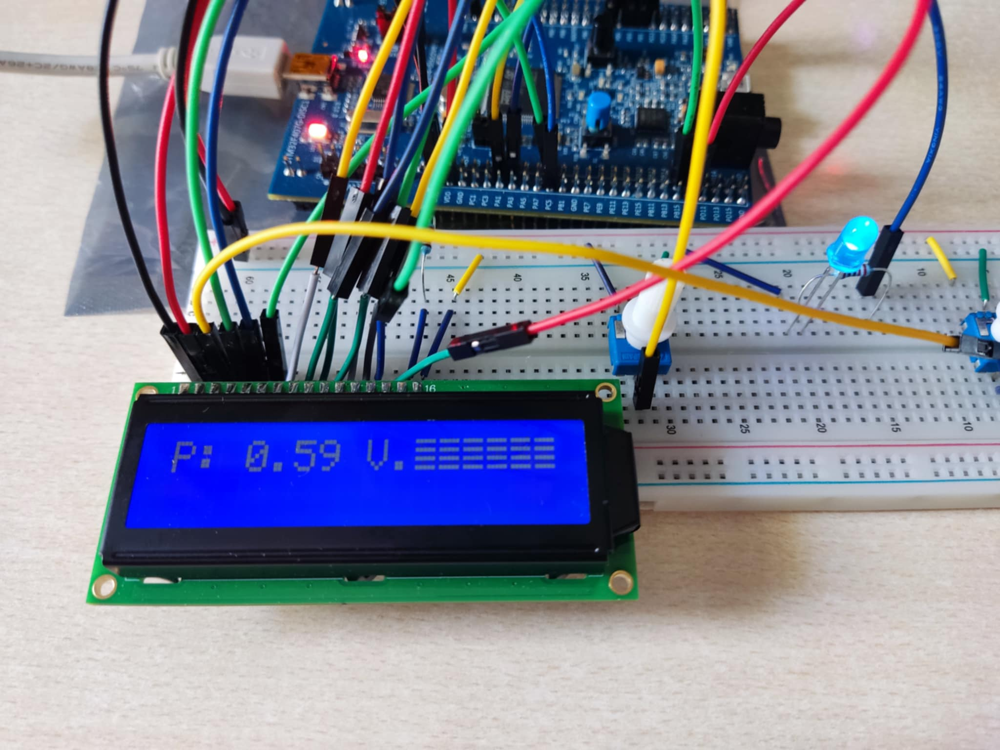
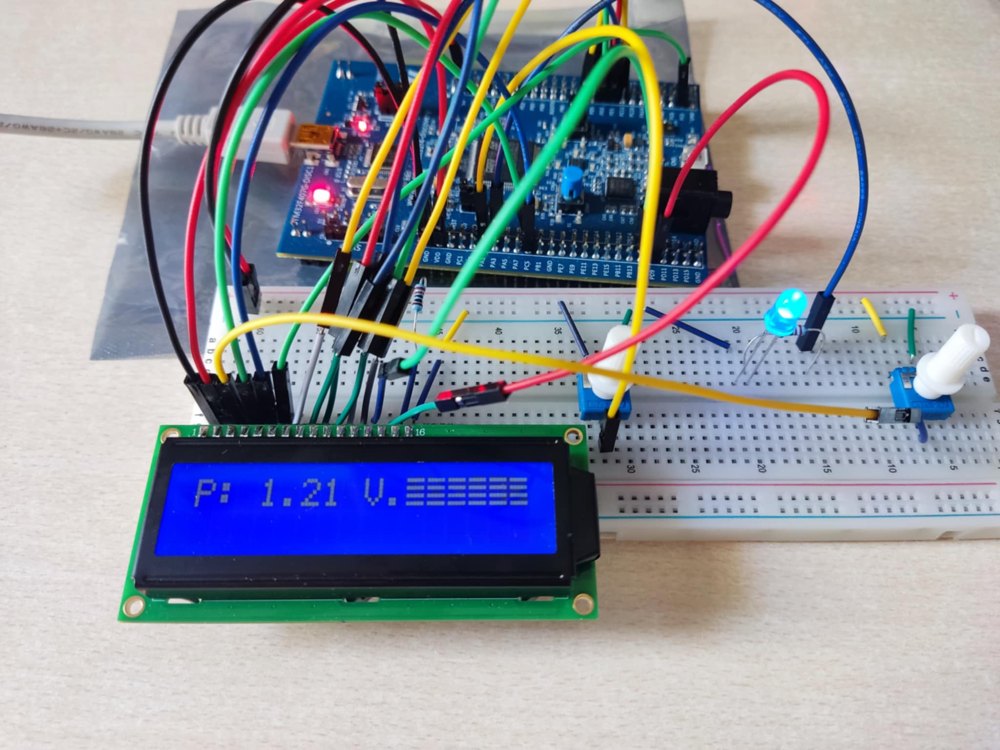
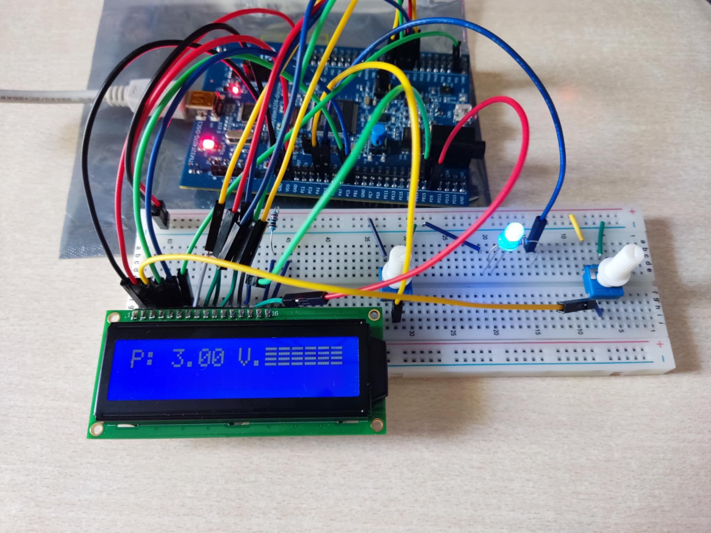

# Project_1:  "LED_On_Breadboard"

## Simple project with external buttons triggering the LEDs to ON state for a couple of seconds via interrupts.

### First LED ON:

### Second LED ON: 

# Project_2: "Analog_Read" 

## Utilization of two ADCs(ADC1 and ADC2) to capture analog outputs from a temperature sensor and a potensiometer. The potensiometer's value regulates a PWM(generated from TIMER2) signal which adjusts the brightness of an LED. The values captured from the ADC modules are forwarded to USART1 which is connected to a UART->USB converter that sends messages to Tera Term in our PC.

### Potensiometer with Low output:

### Potensiometer with High output:

### USART1 outputs in Tera Term for the previous cases:

# Project_3: "LED_ON_Example"

## Simple Project where by pushing the User Button of STM32F407G the internal LEDs are switching blinking patterns. In total, there are 4 blinking patterns. The LEDs are blinking every 1 second. 

# Project_4: "Traffic_Lights"

## A project that simulates the functionality of a Traffic Lights system. GREEN LED stays ON for 15 seconds, the YELLOW LED stays ON for 5 seconds and the RED LED stays ON for 15 seconds. This procedure keeps going on until the system needs maintenance(first BUTTON is pressed). In maintenance, the other two LEDs are blinking alternatingly every 1 second and UART4 prints in Tera Term that the system is under maintenance. The system returns to its original functionality by pressing the second BUTTON(maintenance completed).

### Traffic Lights System when the RED LED is ON:

# Project_5: "Analog_Read_LCD"

## A project similar to Analog_Read where custom LCD drivers have been developed to display the Regulated Voltage from the Potensiometer. These drivers act as mediator for the communication between the microcontroller and the LCD Display. 

### Below there are 3 images showing the different values being displayed on the LCD for different Potensiometer Voltages:

#### Image 1:

#### Image 2:

#### Image 3:
